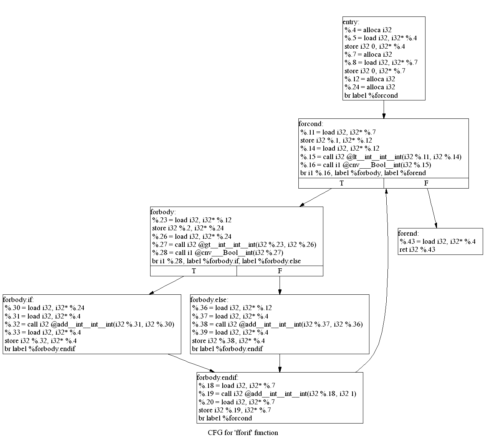
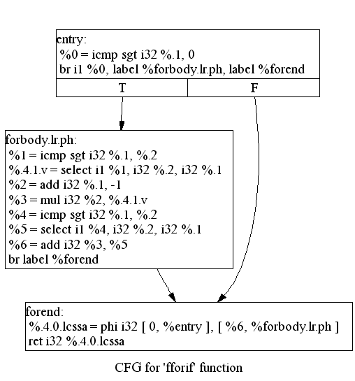

# Epycc: Embedded Python C Compiler

Embedded Python C Compiler is a Python 2.7 module that allows JIT compiling and invoking C code seamlessly from Python, as if it was a Python function, but at native non-interpreted execution speeds (faster than numpy or numba, see [Performance](#performance) below).

```python
c_code = """
float f2pow2(int a) {
    return 2.0f * (a * a);
}
"""
lib = epycc_compile(c_code)
print lib.f2pow2(2)
```
```python
8.0
```

## Current functionality
- [x] Parse all C99 code (only missing C lexer hack)
- [x] Generate IR for floating point and integer expressions, casts
- [x] Generate IR for function definitions
- [x] Generate IR for assigning / reading to / from function parameters and local scalar variables
- [x] Generate IR for if then / else statements
- [x] Generate IR for for/while continue/break statements
- [x] Generate IR for internal function calls, forward function declarations, direct and indirect recursive functions
- [x] Generate IR for arrays (open, runtime, and compile time sized)
- [x] Generate IR for structs, arrays of structs, structs of arrays
- [x] Execute generated IR seamlessly like a Python function
- [x] "ctypable" transparent Python parameter passing support, including converting Python lists to C arrays under the hood

Check the [tests directory](tests/cfiles) for examples of the currently supported constructs.


## Future functionality
- [ ] Generate IR for switch statements
- [ ] Generate IR for pointers, sizeof, addressof operator
- [ ] Generate IR for unions, user defined types, bitfields
- [ ] Generate IR for vararg functions
- [ ] Generate IR for global variables/constants
- [ ] Generate IR for global constructors (via llvm.global_ctors or manually)
- [ ] Parse lexer hack
- [ ] Assembler support
- [ ] Widely used compiler-specific pragma/attributes/declspec (thread, packed, aligned...). See https://clang.llvm.org/docs/AttributeReference.html
- [ ] Packaging into a proper Python package
- [ ] Publishing to Pypi
- [ ] External native function calling from inside C
- [ ] Python function calling from inside C
- [ ] Spilling generated IR or executable to disk for distribution
- [ ] C runtime, invoking Python's in-process loaded runtime via external native function calls
- [ ] C preprocessor, include file support
- [ ] Compile arbitrary C sources (and call external DLL/so functions)
- [ ] Python 3.x compatible


# Implementation details
- C99 grammar straight and unmodified from the 9899:1999 spec
- Clang for precompiling C code into IR snippets that get called internally.
- Generated code validation via comparison vs. clang-generated code
- [Lark](https://github.com/lark-parser/lark) for parsing
- [llvmlite](https://github.com/numba/llvmlite/) for JIT compiling LLVM IR into executable code.


## Simple Example


### Original C code

```python
c_code = """
float f2pow2(int a) {
    return 2.0f * (a * a);
}
"""
lib = epycc_compile(c_code)
print lib.f2pow2(2)
```
```python
8.0
```

Internally it generates LLVM IR and uses [llvmlite](https://github.com/numba/llvmlite/) to JIT compile it into executable machine code in memory.

The generated LLVM IR code calls into LLVM IR snippets pregenerated from C code. This is in order to accelerate epycc development and perform some brittle tasks like C99-compliant type conversion, etc:

```python
print lib.ir
```
```LLVM
; ModuleID = '<string>'
source_filename = "<string>"
target datalayout = "e-m:e-i64:64-f80:128-n8:16:32:64-S128"

define float @f2pow2(i32 %.1) {
entry:
  %.3 = alloca i32
  store i32 %.1, i32* %.3
  %.5 = load i32, i32* %.3
  %.6 = load i32, i32* %.3
  %.7 = call i32 @mul__int__int__int(i32 %.5, i32 %.6)
  %.8 = call float @cnv__float__int(i32 %.7)
  %.9 = call float @mul__float__float__float(float 2.000000e+00, float %.8)
  ret float %.9
}

define dso_local float @cnv__float__int(i32) {
  %2 = alloca i32, align 4
  store i32 %0, i32* %2, align 4
  %3 = load i32, i32* %2, align 4
  %4 = sitofp i32 %3 to float
  ret float %4
}

define dso_local float @mul__float__float__float(float, float) {
  %3 = alloca float, align 4
  %4 = alloca float, align 4
  store float %1, float* %3, align 4
  store float %0, float* %4, align 4
  %5 = load float, float* %4, align 4
  %6 = load float, float* %3, align 4
  %7 = fmul float %5, %6
  ret float %7
}

define dso_local i32 @mul__int__int__int(i32, i32) {
  %3 = alloca i32, align 4
  %4 = alloca i32, align 4
  store i32 %1, i32* %3, align 4
  store i32 %0, i32* %4, align 4
  %5 = load i32, i32* %4, align 4
  %6 = load i32, i32* %3, align 4
  %7 = mul nsw i32 %5, %6
  ret i32 %7
}

; Function Attrs: nounwind
declare void @llvm.stackprotector(i8*, i8**) #0

attributes #0 = { nounwind }
```

Note using those snippets doesn't suppose any performance issues because LLVM optimizes them away inlining the calls and removing any unnecessary load/stores:

```python
print lib.ir_optimized
```
```LLVM
; ModuleID = '<string>'
source_filename = "<string>"
target datalayout = "e-m:e-i64:64-f80:128-n8:16:32:64-S128"

; Function Attrs: norecurse nounwind readnone
define float @f2pow2(i32 %.1) local_unnamed_addr #0 {
entry:
  %0 = mul nsw i32 %.1, %.1
  %1 = sitofp i32 %0 to float
  %2 = fmul float %1, 2.000000e+00
  ret float %2
}

; Function Attrs: norecurse nounwind readnone
define dso_local float @cnv__float__int(i32) local_unnamed_addr #0 {
  %2 = sitofp i32 %0 to float
  ret float %2
}

; Function Attrs: norecurse nounwind readnone
define dso_local float @mul__float__float__float(float, float) local_unnamed_addr #0 {
  %3 = fmul float %0, %1
  ret float %3
}

; Function Attrs: norecurse nounwind readnone
define dso_local i32 @mul__int__int__int(i32, i32) local_unnamed_addr #0 {
  %3 = mul nsw i32 %1, %0
  ret i32 %3
}

attributes #0 = { norecurse nounwind readnone }
```

```python
print lib.asm_optimized
```
```assembly
	.text
	.intel_syntax noprefix
	.file	"<string>"
	.globl	f2pow2
	.p2align	4, 0x90
	.type	f2pow2,@function
f2pow2:
	imul	ecx, ecx
	cvtsi2ss	xmm0, ecx
	addss	xmm0, xmm0
	ret
.Lfunc_end0:
	.size	f2pow2, .Lfunc_end0-f2pow2

	.globl	cnv__float__int
	.p2align	4, 0x90
	.type	cnv__float__int,@function
cnv__float__int:
	cvtsi2ss	xmm0, ecx
	ret
.Lfunc_end1:
	.size	cnv__float__int, .Lfunc_end1-cnv__float__int

	.globl	mul__float__float__float
	.p2align	4, 0x90
	.type	mul__float__float__float,@function
mul__float__float__float:
	mulss	xmm0, xmm1
	ret
.Lfunc_end2:
	.size	mul__float__float__float, .Lfunc_end2-mul__float__float__float

	.globl	mul__int__int__int
	.p2align	4, 0x90
	.type	mul__int__int__int,@function
mul__int__int__int:
	mov	eax, ecx
	imul	eax, edx
	ret
.Lfunc_end3:
	.size	mul__int__int__int, .Lfunc_end3-mul__int__int__int


	.section	".note.GNU-stack","",@progbits
```

Since the module includes a full featured C parser, it can also be used to parse and inspect C code.

## A more complex example
### Original C code
```c
int fforif(int a, int b) {
    int s = 0;
    for (int i = 0; i < a; i += 1) {
        if (a > b) {
            s += b;
        } else {
            s += a;
        }
    }
    
    return s;
}
```
### Generated LLVM IR (unoptimized)
```LLVM
define i32 @fifforf(i32 %.1, i32 %.2) {
entry:
  %.4 = alloca i32
  %.5 = load i32, i32* %.4
  store i32 0, i32* %.4
  %.7 = alloca i32
  store i32 %.1, i32* %.7
  %.9 = load i32, i32* %.7
  %.10 = alloca i32
  store i32 %.2, i32* %.10
  %.12 = load i32, i32* %.10
  %.13 = call i32 @gt__int__int__int(i32 %.9, i32 %.12)
  %.14 = call i1 @cnv___Bool__int(i32 %.13)
  %.16 = alloca i32
  %.37 = alloca i32
  br i1 %.14, label %entry.if, label %entry.else

entry.if:                                         ; preds = %entry
  %.17 = load i32, i32* %.16
  store i32 0, i32* %.16
  br label %forcond

entry.else:                                       ; preds = %entry
  %.38 = load i32, i32* %.37
  store i32 0, i32* %.37
  br label %forcond.1

entry.endif:                                      ; preds = %forcond.1, %forcond
  %.58 = load i32, i32* %.4
  ret i32 %.58

forcond:                                          ; preds = %forbody, %entry.if
  %.20 = load i32, i32* %.16
  %.21 = load i32, i32* %.7
  %.22 = call i32 @lt__int__int__int(i32 %.20, i32 %.21)
  %.23 = call i1 @cnv___Bool__int(i32 %.22)
  br i1 %.23, label %forbody, label %entry.endif

forbody:                                          ; preds = %forcond
  %.30 = load i32, i32* %.10
  %.31 = load i32, i32* %.4
  %.32 = call i32 @add__int__int__int(i32 %.31, i32 %.30)
  %.33 = load i32, i32* %.4
  store i32 %.32, i32* %.4
  %.25 = load i32, i32* %.16
  %.26 = call i32 @add__int__int__int(i32 %.25, i32 1)
  %.27 = load i32, i32* %.16
  store i32 %.26, i32* %.16
  br label %forcond

forcond.1:                                        ; preds = %forbody.1, %entry.else
  %.41 = load i32, i32* %.37
  %.42 = load i32, i32* %.10
  %.43 = call i32 @lt__int__int__int(i32 %.41, i32 %.42)
  %.44 = call i1 @cnv___Bool__int(i32 %.43)
  br i1 %.44, label %forbody.1, label %entry.endif

forbody.1:                                        ; preds = %forcond.1
  %.51 = load i32, i32* %.7
  %.52 = load i32, i32* %.4
  %.53 = call i32 @add__int__int__int(i32 %.52, i32 %.51)
  %.54 = load i32, i32* %.4
  store i32 %.53, i32* %.4
  %.46 = load i32, i32* %.37
  %.47 = call i32 @add__int__int__int(i32 %.46, i32 1)
  %.48 = load i32, i32* %.37
  store i32 %.47, i32* %.37
  br label %forcond.1
}

define dso_local i32 @gt__int__int__int(i32, i32) {
  %3 = alloca i32, align 4
  %4 = alloca i32, align 4
  store i32 %1, i32* %3, align 4
  store i32 %0, i32* %4, align 4
  %5 = load i32, i32* %4, align 4
  %6 = load i32, i32* %3, align 4
  %7 = icmp sgt i32 %5, %6
  %8 = zext i1 %7 to i32
  ret i32 %8
}

define dso_local zeroext i1 @cnv___Bool__int(i32) {
  %2 = alloca i32, align 4
  store i32 %0, i32* %2, align 4
  %3 = load i32, i32* %2, align 4
  %4 = icmp ne i32 %3, 0
  ret i1 %4
}

define dso_local i32 @add__int__int__int(i32, i32) {
  %3 = alloca i32, align 4
  %4 = alloca i32, align 4
  store i32 %1, i32* %3, align 4
  store i32 %0, i32* %4, align 4
  %5 = load i32, i32* %4, align 4
  %6 = load i32, i32* %3, align 4
  %7 = add nsw i32 %5, %6
  ret i32 %7
}

define dso_local i32 @lt__int__int__int(i32, i32) {
  %3 = alloca i32, align 4
  %4 = alloca i32, align 4
  store i32 %1, i32* %3, align 4
  store i32 %0, i32* %4, align 4
  %5 = load i32, i32* %4, align 4
  %6 = load i32, i32* %3, align 4
  %7 = icmp slt i32 %5, %6
  %8 = zext i1 %7 to i32
  ret i32 %8
}
```
#### Control Flow Graph

### LLVM IR After LLVM Optimization
```LLVM
define i32 @fifforf(i32 %.1, i32 %.2) local_unnamed_addr #0 {
entry:
  %0 = icmp sgt i32 %.1, %.2
  br i1 %0, label %forcond.preheader, label %forcond.1.preheader

forcond.1.preheader:                              ; preds = %entry
  %1 = icmp sgt i32 %.2, 0
  %2 = mul i32 %.2, %.1
  %spec.select = select i1 %1, i32 %2, i32 0
  ret i32 %spec.select

forcond.preheader:                                ; preds = %entry
  %3 = icmp sgt i32 %.1, 0
  %4 = mul i32 %.2, %.1
  %spec.select10 = select i1 %3, i32 %4, i32 0
  ret i32 %spec.select10
}
```
### Control Flow Graph



# Performance 


The graph shows the performance of transforming an increasing number of 4D vectors by a 4x4 matrix, using python, pyrr, numba, numpy and epycc. See [test_perf.py](tests/test_perf.py)

Where
- no params: Empty function called with no arguments.
- params only: Empty function called using the same arguments as the full function call.
- numpy: Calling the function using numpy arrays as arguments.
- ctypes: Calling the function using ctypes as arguments.
- tuple: Calling the function using Python tuples (but for the output which has to be list since tuples are immutable)
- list: Calling the function using Python lists

## Summary
- Epycc is the fastest in performing the calculation, 1.5x the speed of numpy, 40x the speed of numba, and 700x the speed of Python
- When the input parameters are already numpy arrays, numpy is 2x the speed of Epycc due to Epycc having to convert them to ctypes. This overhead is constant so there's a breaking point beyond the 1000 vertex count tested here where Epycc is faster than numpy.
- Epycc seamlessly accepts Python tuples and lists, but converting them to ctypes is very slow (Epycc using ctypes directly is 1700x faster than using lists, and 1000x faster than using tuples)
- Numba call overhead is very low, 1.5x the speed of calling a Python function and 2x the speed of calling an Epycc function
- Numba parameter passing overhead using numpy arrays is very low, 15x the speed of Epycc using numpy, and 1.5x the speed of Epycc using ctypes.
- Numba calculation time slowness is due to inefficient code generation (no inlining, no unrolling) and refcount overhead. When both Epycc and Numba use numpy arrays for parameters, Epycc is 15x the speed of Numba.
- Pyrr is the same speed as Python despite using numpy, since apply_to_vector cannot do matrix by array of vector multiplication and has to be done manually in a Python loop (or use numpy, but at that point you might as well just use numpy, see https://github.com/adamlwgriffiths/Pyrr/issues/106)


## Details

This study looks at:
- The numba, python and Epycc function call overhead
- The numba and Epycc parameter passing overhead for different parameter types.
- The numba, python, Epycc and numpy execution speed of transforming N 4D vectors by a 4x4 matrix

### Package Versions Used
- python 2.7
- numba 0.47.0
- llvmlite 0.31.0
- numpy 1.13.3
- pyrr 0.10.3

### Sources
epycc code (c99)
```c
float dot_prod_vector(float v[4], float w[4])
{
    float res = 0.0f;
    for (int i = 0; i < 4; ++i)
    {
        res += v[i] * w[i];
    }
    return res;
}

void transform_vector(float mat[4][4], float in[4], float out[4])
{
    for (int i = 0; i < 4; ++i)
    {
        out[i] = dot_prod_vector(mat[i], in);
    }

}

void transform_vectors(float matrix[4][4], float in[][4], float out[][4], int count) {
    for (int i = 0; i < count; ++i) 
    {
        transform_vector(matrix, in[i], out[i]);
    }
}
void transform_vectors_empty(float matrix[4][4], float in[][4], float out[][4], int count) {
    return;
}
void empty() {
}
```

Python code
```python
def dot_prod(v, w):
    return sum([vi * wi for vi, wi in zip(v, w)])
    
def transform_vector(mat, v):
    return [dot_prod(row, v) for row in mat]

def transform_vectors(mat, vs, vsout):
    vsout[:] = [transform_vector(mat, v) for v in vs]
    
def python_empty():
    pass
```

Numba code
```python
@nb.njit
def nb_dot_prod(v, w):
    # Numba cannot determine the type of sum, switch to loop
    # return np.sum([vi * wi for vi, wi in zip(v, w)])

    # This needs to be specified as float32 so the result is accumulated in 
    # float32, even if the arguments are already float32
    res = np.float32(0)
    for vi, wi in zip(v, w):
        res += vi * wi

    return res

@nb.njit
def nb_transform_vector(mat, v, vout):
    # Numba errors out with
    # "Direct iteration is not supported for arrays with dimension > 1"
    # Need to use array indexing instead of element traversing
    for i in xrange(len(mat)):
        vout[i] = nb_dot_prod(mat[i], v)


@nb.njit
def nb_transform_vectors(mat, vs, vsout):
    # Numba errors out with
    # "Direct iteration is not supported for arrays with dimension > 1"
    # Need to use array indexing instead of element traversing
    # To get really good performance, don't let numba generate python lists and
    # pass arrays for source and destination
    for i in xrange(len(vs)):
        nb_transform_vector(mat, vs[i], vsout[i])

@nb.njit
def nb_transform_vectors_empty(mat, vs, vsout):
    pass

@nb.njit
def nb_empty():
    pass
```

Numpy code
```python
npvectors.dot(npmatrix.T, npvectors_out)
```
### Call Overhead


### Parameter Overhead


### Full Call


### Numba vs. Epycc codegen

#### Epycc

```assembly
	.text
	.intel_syntax noprefix
	.file	"<string>"
	.globl	transform_vectors
	.p2align	4, 0x90
	.type	transform_vectors,@function
transform_vectors:
	test	r9d, r9d
	jle	.LBB2_3
	mov	r9d, r9d
	mov	eax, 12
	xorps	xmm0, xmm0
	.p2align	4, 0x90
.LBB2_2:
	movss	xmm1, dword ptr [rcx]
	movss	xmm2, dword ptr [rcx + 4]
	mulss	xmm1, dword ptr [rdx + rax - 12]
	addss	xmm1, xmm0
	mulss	xmm2, dword ptr [rdx + rax - 8]
	addss	xmm2, xmm1
	movss	xmm1, dword ptr [rcx + 8]
	mulss	xmm1, dword ptr [rdx + rax - 4]
	addss	xmm1, xmm2
	movss	xmm2, dword ptr [rcx + 12]
	mulss	xmm2, dword ptr [rdx + rax]
	addss	xmm2, xmm1
	movss	dword ptr [r8 + rax - 12], xmm2
	movss	xmm1, dword ptr [rcx + 16]
	movss	xmm2, dword ptr [rcx + 20]
	mulss	xmm1, dword ptr [rdx + rax - 12]
	addss	xmm1, xmm0
	mulss	xmm2, dword ptr [rdx + rax - 8]
	addss	xmm2, xmm1
	movss	xmm1, dword ptr [rcx + 24]
	mulss	xmm1, dword ptr [rdx + rax - 4]
	addss	xmm1, xmm2
	movss	xmm2, dword ptr [rcx + 28]
	mulss	xmm2, dword ptr [rdx + rax]
	addss	xmm2, xmm1
	movss	dword ptr [r8 + rax - 8], xmm2
	movss	xmm1, dword ptr [rcx + 32]
	movss	xmm2, dword ptr [rcx + 36]
	mulss	xmm1, dword ptr [rdx + rax - 12]
	addss	xmm1, xmm0
	mulss	xmm2, dword ptr [rdx + rax - 8]
	addss	xmm2, xmm1
	movss	xmm1, dword ptr [rcx + 40]
	mulss	xmm1, dword ptr [rdx + rax - 4]
	addss	xmm1, xmm2
	movss	xmm2, dword ptr [rcx + 44]
	mulss	xmm2, dword ptr [rdx + rax]
	addss	xmm2, xmm1
	movss	dword ptr [r8 + rax - 4], xmm2
	movss	xmm1, dword ptr [rcx + 48]
	movss	xmm2, dword ptr [rcx + 52]
	mulss	xmm1, dword ptr [rdx + rax - 12]
	addss	xmm1, xmm0
	mulss	xmm2, dword ptr [rdx + rax - 8]
	addss	xmm2, xmm1
	movss	xmm1, dword ptr [rcx + 56]
	mulss	xmm1, dword ptr [rdx + rax - 4]
	addss	xmm1, xmm2
	movss	xmm2, dword ptr [rcx + 60]
	mulss	xmm2, dword ptr [rdx + rax]
	addss	xmm2, xmm1
	movss	dword ptr [r8 + rax], xmm2
	add	rax, 16
	dec	r9
	jne	.LBB2_2
.LBB2_3:
	ret
.Lfunc_end2:
	.size	transform_vectors, .Lfunc_end2-transform_vectors

```
#### Numba
```assembly
	.text
	.intel_syntax noprefix
	.file	"<string>"
	.globl	_ZN8__main__24nb_transform_vectors$243E5ArrayIfLi2E1C7mutable7alignedE5ArrayIfLi2E1C7mutable7alignedE5ArrayIfLi2E1C7mutable7alignedE
	.p2align	4, 0x90
	.type	_ZN8__main__24nb_transform_vectors$243E5ArrayIfLi2E1C7mutable7alignedE5ArrayIfLi2E1C7mutable7alignedE5ArrayIfLi2E1C7mutable7alignedE,@function
_ZN8__main__24nb_transform_vectors$243E5ArrayIfLi2E1C7mutable7alignedE5ArrayIfLi2E1C7mutable7alignedE5ArrayIfLi2E1C7mutable7alignedE:
	.cfi_startproc
	push	r15
	.cfi_def_cfa_offset 16
	push	r14
	.cfi_def_cfa_offset 24
	push	r13
	.cfi_def_cfa_offset 32
	push	r12
	.cfi_def_cfa_offset 40
	push	rsi
	.cfi_def_cfa_offset 48
	push	rdi
	.cfi_def_cfa_offset 56
	push	rbp
	.cfi_def_cfa_offset 64
	push	rbx
	.cfi_def_cfa_offset 72
	sub	rsp, 264
	.cfi_def_cfa_offset 336
	.cfi_offset rbx, -72
	.cfi_offset rbp, -64
	.cfi_offset rdi, -56
	.cfi_offset rsi, -48
	.cfi_offset r12, -40
	.cfi_offset r13, -32
	.cfi_offset r14, -24
	.cfi_offset r15, -16
	mov	qword ptr [rsp + 256], r9
	mov	qword ptr [rsp + 232], rdx
	mov	qword ptr [rsp + 240], rcx
	mov	rsi, qword ptr [rsp + 496]
	mov	r14, qword ptr [rsp + 464]
	mov	rbx, qword ptr [rsp + 424]
	mov	qword ptr [rsp + 224], 0
	mov	qword ptr [rsp + 216], 0
	movabs	rdi, offset NRT_incref
	mov	qword ptr [rsp + 208], r8
	mov	rcx, r8
	call	rdi
	mov	rcx, rbx
	call	rdi
	mov	rcx, rsi
	call	rdi
	test	r14, r14
	jle	.LBB0_7
	mov	rax, qword ptr [rsp + 544]
	mov	rbp, qword ptr [rsp + 528]
	mov	rcx, qword ptr [rsp + 472]
	mov	rdi, qword ptr [rsp + 456]
	lea	rax, [4*rax]
	mov	qword ptr [rsp + 248], rax
	lea	r13, [4*rcx]
	movabs	r12, offset NRT_decref
	movabs	r15, offset NRT_incref
	.p2align	4, 0x90
.LBB0_2:
	mov	rcx, rbx
	call	r15
	mov	rcx, rsi
	call	r15
	mov	qword ptr [rsp + 224], 0
	mov	rax, qword ptr [rsp + 560]
	mov	qword ptr [rsp + 192], rax
	mov	rax, qword ptr [rsp + 544]
	mov	qword ptr [rsp + 184], rax
	mov	qword ptr [rsp + 176], rbp
	mov	rcx, qword ptr [rsp + 520]
	mov	qword ptr [rsp + 168], rcx
	mov	qword ptr [rsp + 160], rax
	mov	rax, qword ptr [rsp + 504]
	mov	qword ptr [rsp + 152], rax
	mov	qword ptr [rsp + 144], rsi
	mov	rax, qword ptr [rsp + 488]
	mov	qword ptr [rsp + 136], rax
	mov	rax, qword ptr [rsp + 472]
	mov	qword ptr [rsp + 128], rax
	mov	qword ptr [rsp + 120], rdi
	mov	rcx, qword ptr [rsp + 448]
	mov	qword ptr [rsp + 112], rcx
	mov	qword ptr [rsp + 104], rax
	mov	rax, qword ptr [rsp + 432]
	mov	qword ptr [rsp + 96], rax
	mov	qword ptr [rsp + 88], rbx
	mov	rax, qword ptr [rsp + 416]
	mov	qword ptr [rsp + 80], rax
	mov	rax, qword ptr [rsp + 408]
	mov	qword ptr [rsp + 72], rax
	mov	rax, qword ptr [rsp + 400]
	mov	qword ptr [rsp + 64], rax
	mov	rax, qword ptr [rsp + 392]
	mov	qword ptr [rsp + 56], rax
	mov	rax, qword ptr [rsp + 384]
	mov	qword ptr [rsp + 48], rax
	mov	rax, qword ptr [rsp + 376]
	mov	qword ptr [rsp + 40], rax
	mov	rax, qword ptr [rsp + 368]
	mov	qword ptr [rsp + 32], rax
	lea	rcx, [rsp + 224]
	lea	rdx, [rsp + 216]
	mov	r8, qword ptr [rsp + 208]
	mov	r9, qword ptr [rsp + 256]
	movabs	rax, offset _ZN8__main__23nb_transform_vector$244E5ArrayIfLi2E1C7mutable7alignedE5ArrayIfLi1E1C7mutable7alignedE5ArrayIfLi1E1C7mutable7alignedE
	call	rax
	cmp	eax, -2
	je	.LBB0_6
	test	eax, eax
	jne	.LBB0_4
.LBB0_6:
	mov	rcx, rsi
	call	r12
	mov	rcx, rbx
	call	r12
	add	rbp, qword ptr [rsp + 248]
	add	rdi, r13
	add	r14, -1
	jg	.LBB0_2
.LBB0_7:
	movabs	rdi, offset NRT_decref
	mov	rcx, rsi
	call	rdi
	mov	rcx, rbx
	call	rdi
	mov	rcx, qword ptr [rsp + 208]
	call	rdi
	mov	rax, qword ptr [rsp + 240]
	mov	qword ptr [rax], 0
	xor	eax, eax
	jmp	.LBB0_5
.LBB0_4:
	mov	rcx, qword ptr [rsp + 216]
	mov	rdx, qword ptr [rsp + 232]
	mov	qword ptr [rdx], rcx
.LBB0_5:
	add	rsp, 264
	pop	rbx
	pop	rbp
	pop	rdi
	pop	rsi
	pop	r12
	pop	r13
	pop	r14
	pop	r15
	ret
.Lfunc_end0:
	.size	_ZN8__main__24nb_transform_vectors$243E5ArrayIfLi2E1C7mutable7alignedE5ArrayIfLi2E1C7mutable7alignedE5ArrayIfLi2E1C7mutable7alignedE, .Lfunc_end0-_ZN8__main__24nb_transform_vectors$243E5ArrayIfLi2E1C7mutable7alignedE5ArrayIfLi2E1C7mutable7alignedE5ArrayIfLi2E1C7mutable7alignedE
	.cfi_endproc

```
